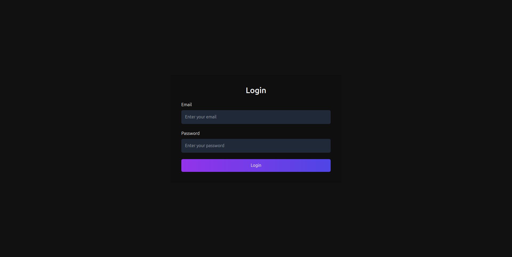
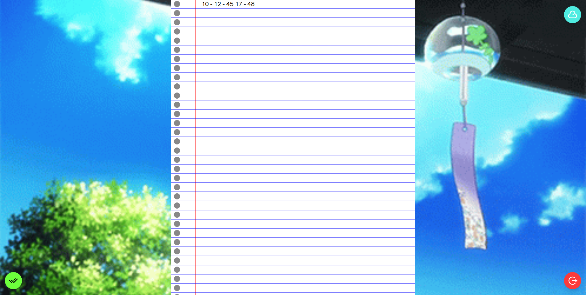
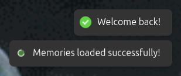

<!-- Jai Shree Ram -->

# 📔 My Diary.

A secure and digital diary to write life's moments.

## ✨ Features

- 📝 Daily entries with timestamps
- 🔒 Private and secure using supabase sessions


## 🚀 Getting Started

### NOTE => 

a) Make Sure you have put your api key , projecturl of ur supabse db.
b) Create a table named "diary_entries"
c) create coloums [taarik , created_at , content , user_id]
d) enable select , insert rules in your RLS
e) add your email as user in authentication in supabase.


1. Clone the repository:
```bash
git clone https://github.com/yourusername/diary.git
cd diary
```

2. Install dependencies:
```bash
npm i
```

3. Start the development server:
```bash
npm run dev
```

## Screenshots =>

1. "/login"


2. "/" (availble when logged in)


memory icon => 

3. "/memories"


4. "/memory/memory_id"


5. Status Icons used in Apps through react-hot-toast



---
Made with ❤️ for personal journaling
by Arpit -_-

